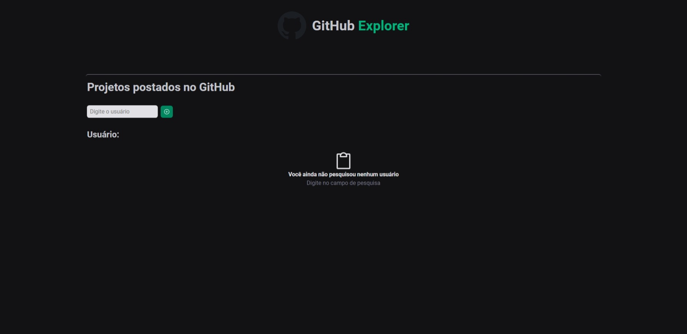
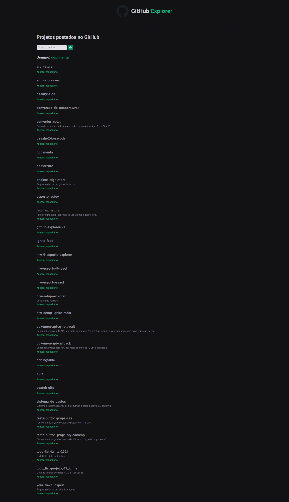
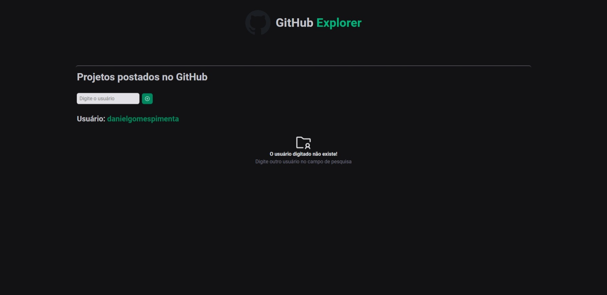
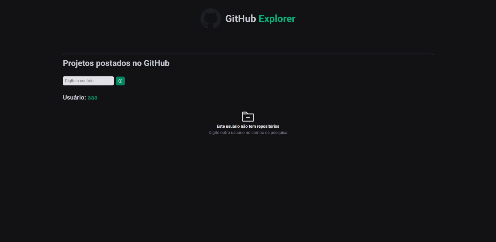

<h1 align="center"> GitHub Explorer </h1>

Página de pesquisa usuários com repositórios no GitHub.

 

 

## 🚀 Tecnologias

Esse projeto foi desenvolvido com as seguintes tecnologias:

- HTML e CSS
- JavaScript
- React.JS
- TypeScript

 

## 💻 Projeto

Site que pesquisa os repositórios dos usuários no GitHub.

 

- [Acesse o projeto finalizado, online]()

 

## 🔖 Layout

Layout quando o usuário não existe ou existe, mas não possui nenhum repositório:

 

 

---